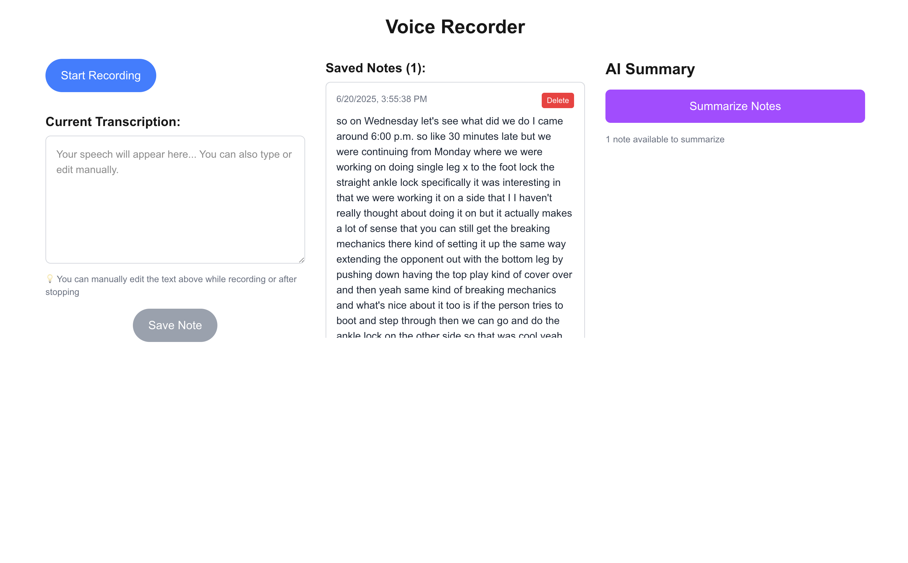

# BJJ Notes

A prototype for capturing and summarizing jiu-jitsu notes using voice recording and AI. (Built with Cursor)



## Features

- 🎙️ **Voice Recording** - Record training notes with speech-to-text
- ✏️ **Manual Editing** - Edit transcriptions before saving
- 💾 **Persistent Storage** - Notes saved with InstantDB
- 🤖 **AI Summarization** - Convert notes to first-person format using Claude
- 📋 **Copy to Clipboard** - Easy sharing of summaries

## Tech Stack

- **Next.js** - React framework
- **InstantDB** - Real-time database
- **Claude (Anthropic)** - AI summarization
- **Tailwind CSS** - Styling
- **Web Speech API** - Voice recording

## Setup

1. Clone and install dependencies:

```bash
pnpm install
```

2. Set environment variables in `.env.local`:

```
NEXT_PUBLIC_INSTANT_APP_ID=your_instant_app_id
ANTHROPIC_API_KEY=your_anthropic_api_key
```

3. Run the development server:

```bash
pnpm dev
```

Open [http://localhost:3000](http://localhost:3000) to start recording notes.
